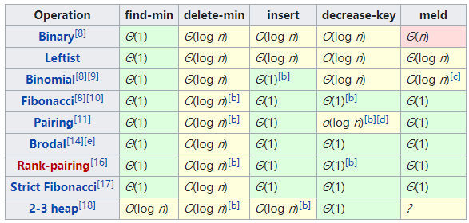
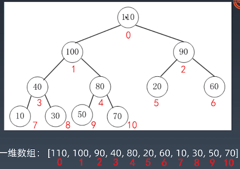
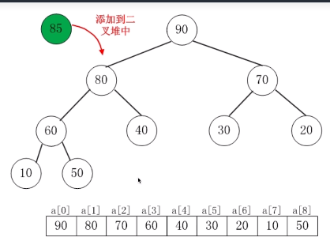
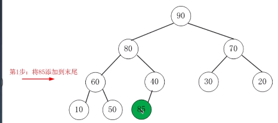
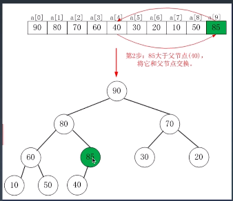
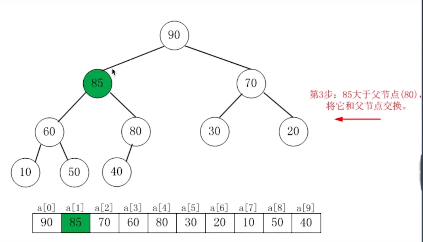
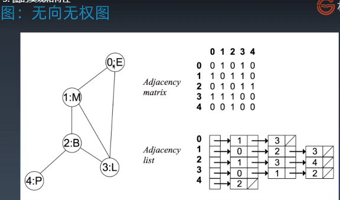
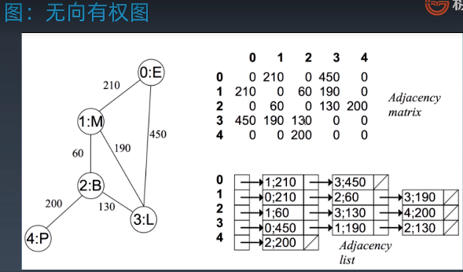
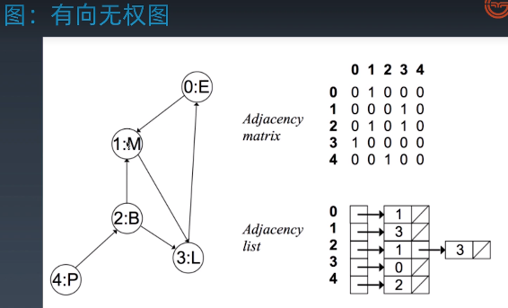

学习笔记
### 哈希表、映射、集合的实现与特性

* Hash table（哈希表 散列表）
  * 哈希表是键值对配对的数据结构，将key通过hash function转换为数组的索引。从而达到快速搜索的效果。
  * 不同的key通过hash function获得的数字相同的时候，我们就称发生了hash 碰撞，所以设置的hash function很关键要尽量减少hash冲突的概率，一般不能通过数字（index）推算出原始数据key（所以也称单向哈希算法）。

  * 解决hash碰撞的方法一般有：开放寻址法和链表法。
  * [v8中HashTable代码](https://github.com/v8/v8/commit/0e8e0030775518b69eb8522823ea3754e6bddc69#diff-2b73f7df77a2d3cc8eb1a03e93b2d5d8)
  * [hashTable.js](./hashTable.js)


### 二叉树

* 二叉树（Binary Tree）特点:
  * 每个结点最多两个分支结点) 左子树、右子树;
  * 结点可以为0，空树;
  * 分支有左右次序;
* 特殊的二叉树
  * 满二叉树，每一层上结点数都是最大结点数。
  * 完全二叉树，除最后一层外，若其余层都是满的，并且最后一层或者是满的，或者是在右边缺少连续若干节点。

  ```js
    //二叉树 结点的定义
    classTreeNode{
      constructor(value){
        this.value=value;
        this.left=null;
        this.right=null;
      }  
    }
    //一个结点 类似左右指针
  ```

* 二叉树遍历 (Pre-order/In-order/Post-roder)方式：

  1. 前序DLR （pre-order）：根-左-右
  2. 中序LDR （In-order）：左-根-右
  3. 后序LRD （Post-orer）:左-右-根

  ```js
  //前序
  root.val
  preorderTraversal(root.left)
  preorderTraversal(root.right)

  //中序
  inorderTraversal(root.left);
  root.val;
  inorderTraversal(root.right)

  //后序
  postorderTraversal(root.left) 
  postorderTraversal(root.right) 
  root.val  
  
  ```


* 二叉搜索树
  定义：二叉排序树、有序二叉树、排序二叉树(Sorted Binary Tree),是指一颗*空树*或者具有下列性质的二叉树：
  1. 左子树上*所有结点*的值均小于它的根结点的值;
  2. 右子树上*Z所有结点*的值均大于它的根结点的值;
  3. 以此类推：左、右子树也分别为二叉搜索树。（重复性） 。中序遍历是升序遍历
  4. 常见操作及时间复杂度
    1. 查询 log2n
    2. 插入新节点(创建) log2n
    3. 删除 （叶子上删除 非叶子上删除） 非叶子上 需要查找第一个大于或者小于的叶子节点 替换要删除节点的位置。
  

### 堆 Heap 和 二叉堆 Binary Heap

* 特点：找到一堆数中的最大或者最小值的数据结构;
* 分类：大顶堆和小顶堆;
* 常见堆：二叉堆、斐波那契堆;
* 常见堆发操作和对应的复杂度<br/>
  

* 二叉堆
  * 性质
    * 通过完全二叉树来实现的(注意不是二叉搜索树);
    * 是一个完全树;
    * (大顶堆)树种任意节点的值总是*大于等于*其子节点的值;
  * 实现细节
    * 二叉堆一般使用*数组*来实现;
    * 假设*第一个元素*索引为*0*，则父节点和子节点*位置关系*如下：
      * 索引为i的左child索引为(2*i+1);
      * 索引为i的右child索引为(2*+2);
      * 索引为i的父节点的索引为floor((i-1)/2);
      * 例子<br/>
        

    * insert （heapifyUp）O(logN)
      1. 新元素一律先插入到堆的尾部;
      2. 依次向上调整整个堆的结构（一直到根节点即可）（如果大于父节点就和父节点交互位置）
      3. 例子<br/>
        
        
        
        
       4. 总结二叉堆插入操作
         * 先将元素插入到堆的尾部，然后再和父节点进行比较如果大于就交互位置，一直遇到小于它的或者根节点为止；
    * delete Max 删除堆顶操作 HeapifyDown O(logN)
      1. 将堆尾元素替换到顶部（堆顶被替代删除掉）;
      2. 依次从根本向下调整整个堆的结构(一直到堆尾即可);

* [js堆实现的代码](./heap.js)

* 总结
 1. 堆是一直数据结构，二叉堆、斐波拉契堆等都是堆的实现。
 2. 二叉堆是堆的一种常见简单的实现，但是并不是最优的实现,工程中一般直接用优先队列(priority_queue)
 
  
### 图  

* 图的构成：点和边（有向和无向 加权重）

* 图的表示（邻接矩阵或者邻接表）和分类<br/>
  
  
  